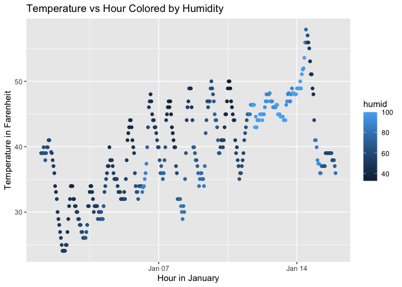

P8105 Homework 1
================
ss7636

## Problem 1

``` r
library(moderndive)
data("early_january_weather")
early_january_weather
```

    ## # A tibble: 358 × 15
    ##    origin  year month   day  hour  temp  dewp humid wind_dir wind_speed
    ##    <chr>  <int> <int> <int> <int> <dbl> <dbl> <dbl>    <dbl>      <dbl>
    ##  1 EWR     2013     1     1     1  39.0  26.1  59.4      270      10.4 
    ##  2 EWR     2013     1     1     2  39.0  27.0  61.6      250       8.06
    ##  3 EWR     2013     1     1     3  39.0  28.0  64.4      240      11.5 
    ##  4 EWR     2013     1     1     4  39.9  28.0  62.2      250      12.7 
    ##  5 EWR     2013     1     1     5  39.0  28.0  64.4      260      12.7 
    ##  6 EWR     2013     1     1     6  37.9  28.0  67.2      240      11.5 
    ##  7 EWR     2013     1     1     7  39.0  28.0  64.4      240      15.0 
    ##  8 EWR     2013     1     1     8  39.9  28.0  62.2      250      10.4 
    ##  9 EWR     2013     1     1     9  39.9  28.0  62.2      260      15.0 
    ## 10 EWR     2013     1     1    10  41    28.0  59.6      260      13.8 
    ## # ℹ 348 more rows
    ## # ℹ 5 more variables: wind_gust <dbl>, precip <dbl>, pressure <dbl>,
    ## #   visib <dbl>, time_hour <dttm>

``` r
n_row = nrow(early_january_weather)
n_col = ncol(early_january_weather)
mean_temp = mean(early_january_weather$temp)
```

The dataset has 358 rows and 15 columns. The important variables are:
`temp`: temperature in Celsius `month`: 1 (January) `year`: 2013
`humid`: humidity The mean temperature is 39.5821229 degrees Celsius.

``` r
library(ggplot2)
plot = ggplot(early_january_weather, aes(x= time_hour, y = temp, color= humid)) +
  geom_point()+
  labs(title = "Temperature vs Hour Colored by Humidity", 
       x = "Hour",
       y = "Temperature")

plot
```

<!-- -->

``` r
ggsave("weather_plot.png", plot = plot)
```

    ## Saving 7 x 5 in image

## Problem 2

``` r
library(tidyverse)
```

    ## ── Attaching core tidyverse packages ──────────────────────── tidyverse 2.0.0 ──
    ## ✔ dplyr     1.1.4     ✔ readr     2.1.5
    ## ✔ forcats   1.0.0     ✔ stringr   1.5.1
    ## ✔ lubridate 1.9.4     ✔ tibble    3.3.0
    ## ✔ purrr     1.1.0     ✔ tidyr     1.3.1
    ## ── Conflicts ────────────────────────────────────────── tidyverse_conflicts() ──
    ## ✖ dplyr::filter() masks stats::filter()
    ## ✖ dplyr::lag()    masks stats::lag()
    ## ℹ Use the conflicted package (<http://conflicted.r-lib.org/>) to force all conflicts to become errors

``` r
df = 
  tibble(
num = rnorm(10),            
logical = num > 0,          
char=  letters[1:10],            
factor = factor(sample(c("Small", "Medium", "Large"), 10, replace = TRUE))
)

mean(df %>% pull(num))       
```

    ## [1] -0.004362663

``` r
mean(df %>% pull(logical))    
```

    ## [1] 0.4

``` r
mean(df %>% pull(char))          
```

    ## Warning in mean.default(df %>% pull(char)): argument is not numeric or logical:
    ## returning NA

    ## [1] NA

``` r
mean(df %>% pull(factor))  
```

    ## Warning in mean.default(df %>% pull(factor)): argument is not numeric or
    ## logical: returning NA

    ## [1] NA

Cannot take the mean of a character or factor. We were able to take the
mean of numeric and logical variables.

``` r
as.numeric(df %>% pull(logical)) 
```

    ##  [1] 0 0 1 1 0 1 1 0 0 0

``` r
as.numeric(df %>% pull(char)) 
```

    ## Warning: NAs introduced by coercion

    ##  [1] NA NA NA NA NA NA NA NA NA NA

``` r
as.numeric(df %>% pull(factor)) 
```

    ##  [1] 1 3 1 2 3 2 3 1 3 1

For logical vectors, TRUE values are converted to 1 and FALSE values are
converted to 0. This makes sense because R internally stores logicals as
binary values. Taking the mean of a logical vector works because it
gives the proportion of TRUEs. This does not work for character vectors
and we get NA values with a warning because arbitrary characters cannot
be meaningfully mapped to numbers. As a result, the mean cannot be
calculated.Lastly, for the factor, we see the values that the factor
interanally stores the levels as. For example, the first level is coded
as 1, the second as 2, and so on. as.numeric() reveals those codes.
While we can technically compute a mean of these numbers, it is not
meaningful because the numeric codes don’t represent real quantitative
values. This helps explain why the mean function only gives us a
meaningful output for the numerical and logical values, and why it does
not give us anything for the character and factor values.
